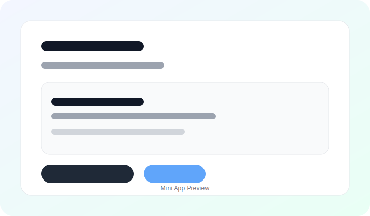

<div align="center">


<h1>🚀 Aiogram Mini App Template</h1>
<p><strong>Production-ready Telegram Bot + Mini Apps template with FastAPI backend and React frontend</strong></p>


</div>

---

## ✨ Features

**Telegram Bot Foundation**
- Built on **aiogram 3.x** with async handlers and modern router setup
- **Dependency Injection** via Dishka for clean architecture
- **PostgreSQL + Redis** with SQLAlchemy ORM and async access
- **Alembic migrations** for database versioning
- **i18n support** with Fluent/Fluentogram
- **aiogram-dialog** for complex multi-step flows
- **FSM support** (Finite State Machine) for forms and wizards
- **Prometheus metrics** middleware ready (`/metrics` when enabled)

**Mini Apps (Main Feature)**
- **React 18 + TypeScript** frontend in `webapp/`
- **Vite** for fast development and hot reload
- **Telegram WebApp SDK** integration (theme, haptics, main button)
- **Secure auth**: HMAC-SHA256 validation of `initData`
- **Replay protection** with `auth_date` TTL (1 hour)
- **Rate limiting**: 100 req/min per IP (in-memory)
- **Full i18next localization**
- **Responsive, mobile-first UI**

**Security Hardened**
- **CORS restricted** to Telegram domains by default
- **Security headers** via nginx (CSP, X-Frame-Options, HSTS, etc.)
- **Non-root Docker containers** for runtime safety
- **SQL injection protection** via ORM
- **XSS protection** via React auto-escaping + CSP

**DevOps Ready**
- **Docker Compose** for one-command deployment
- **Multi-stage Dockerfiles** for slim images
- **nginx** reverse proxy for API + WebApp
- **Structured logging** via Loguru
- **Health checks** for services
- **Pre-commit hooks** (Ruff, Mypy, Black, isort)

---

## ✅ Why Choose This Template?

- **Mini App first**: The bot and WebApp are designed to ship together
- **Production-grade**: migrations, observability, security, and deployment guides
- **Clean architecture**: repositories, UoW, services, DI container
- **Fast onboarding**: Quick Start gets you running in minutes

---

## 🚀 Quick Start (5 minutes)

### 1. Clone & Configure

```bash
git clone https://github.com/MrConsoleka/aiogram-miniapp-template.git
cd aiogram-miniapp-template
cp .env.example .env
```

Edit `.env` and add your bot token from [@BotFather](https://t.me/BotFather):

```env
TG__BOT_TOKEN=YOUR_BOT_TOKEN_HERE
TG__ADMIN_IDS=[YOUR_TELEGRAM_ID]
WEBAPP__URL=http://localhost
```

### 2. Start Everything with Docker

```bash
docker compose up -d
```

That is it. 🎉

- Bot responds to `/start`
- Mini App is available at `http://localhost`
- API is available at `http://localhost/api`
- Open `/profile` in your bot to launch the Mini App

### 3. Or Run Locally (Development)

```bash
# Terminal 1: Backend + Bot
make venv
make install
make run

# Terminal 2: Frontend (Mini App)
cd webapp
npm install
npm run dev
```

If you are running the Vite dev server, set `WEBAPP__URL=http://localhost:3000` in `.env`.

Open your bot and run `/profile` to see the Mini App.

---

## 📚 Documentation

Full documentation lives in `docs/`.

**Getting Started**
- [Installation & Setup](docs/getting-started.md)
- [Configuration Guide](docs/guides/configuration.md)

**Bot Development**
- [Handlers](docs/guides/handlers.md)
- [Services](docs/guides/services.md)
- [Database](docs/guides/database.md)

**Mini Apps Development**
- [Mini Apps Overview](docs/guides/mini-apps/README.md)
- [Quick Start](docs/guides/mini-apps/quickstart.md)
- [Authentication](docs/guides/mini-apps/authentication.md)
- [API Reference](docs/guides/mini-apps/api-reference.md)
- [Frontend Guide](docs/guides/mini-apps/frontend-guide.md)
- [Adding Features](docs/guides/mini-apps/adding-features.md)
- [Theming](docs/guides/mini-apps/theming.md)
- [Security](docs/guides/mini-apps/security.md)
- [Deployment](docs/guides/mini-apps/deployment.md)
- [Troubleshooting](docs/guides/mini-apps/troubleshooting.md)

**Deployment**
- [Docker Guide](docs/guides/docker.md)
- [Production Deployment](docs/guides/deployment.md)

**Reference**
- [Architecture](docs/reference/architecture.md)
- [Project Structure](docs/reference/project-structure.md)
- [REST API Reference](docs/reference/rest-api.md)
- [Python API Reference](docs/reference/api.md)

---

## 🏗️ Architecture

```
┌──────────────────┐      ┌──────────────────┐      ┌──────────────────┐
│   Telegram User  │─────▶│    Your Bot      │─────▶│   PostgreSQL     │
│   (Mobile App)   │      │  (aiogram 3.x)   │      │   + Redis        │
└──────────────────┘      └──────────────────┘      └──────────────────┘
         │                         │
         │ Opens Mini App          │
         ▼                         ▼
┌──────────────────┐      ┌──────────────────┐
│  React Mini App  │◀────▶│  FastAPI Backend │
│   (TypeScript)   │      │   (/api/...)     │
└──────────────────┘      └──────────────────┘
         │                         │
         └────────▶ nginx ◀────────┘
              (reverse proxy)
```

---

## 🎨 Mini App Demo

Preview of the included profile page (replace with your own UI):

<div align="center">
  
</div>

Try it live in your bot with `/profile`.

---

## 🛠️ Tech Stack

### Backend
- **[aiogram 3.x](https://github.com/aiogram/aiogram)** - Async Telegram Bot framework
- **[aiogram-dialog](https://github.com/aiogram/aiogram-dialog)** - Dialog manager
- **[FastAPI](https://fastapi.tiangolo.com/)** - Web API
- **[Dishka](https://github.com/reagento/dishka)** - Dependency injection
- **[SQLAlchemy](https://www.sqlalchemy.org/)** - ORM
- **[Alembic](https://alembic.sqlalchemy.org/)** - Migrations
- **[Pydantic](https://pydantic.dev/)** - Validation and settings
- **[Redis](https://redis.io/)** - FSM storage and caching
- **[Loguru](https://github.com/Delgan/loguru)** - Logging

### Frontend (Mini Apps)
- **[React 18](https://react.dev/)** - UI library
- **[TypeScript](https://www.typescriptlang.org/)** - Type safety
- **[Vite](https://vitejs.dev/)** - Build tool
- **[Telegram WebApp SDK](https://core.telegram.org/bots/webapps)** - Mini Apps API
- **[i18next](https://www.i18next.com/)** - Internationalization
- **[Zustand](https://github.com/pmndrs/zustand)** - State management

### DevOps
- **Docker** + **Docker Compose**
- **nginx** reverse proxy
- **Ruff**, **Mypy**, **Black**, **isort**, **pre-commit**

---

## 📁 Project Structure

```
aiogram-miniapp-template/
├── source/                # Python source code
│   ├── api/              # FastAPI backend for Mini Apps
│   ├── telegram/         # Bot handlers, keyboards, filters
│   ├── database/         # Models, repositories, migrations
│   ├── services/         # Business logic layer
│   ├── config/           # Settings and configuration
│   └── utils/            # Helpers, logger, i18n
├── webapp/               # React Mini App frontend
│   ├── src/
│   ├── public/locales/
│   └── vite.config.ts
├── docs/                 # Documentation
├── nginx/                # nginx configurations
├── migrations/           # Alembic migrations
├── tests/                # Test suite
└── docker-compose.yml    # Docker orchestration
```

Full structure is documented in [docs/reference/project-structure.md](docs/reference/project-structure.md).

---

## 🔐 Security

| Feature | Status | Notes |
|---------|--------|-------|
| HMAC-SHA256 Validation | ✅ | Verifies Telegram `initData` signature |
| Replay Attack Protection | ✅ | `auth_date` TTL = 1 hour |
| CORS Restrictions | ✅ | Telegram domains only (default) |
| Rate Limiting | ✅ | 100 req/min per IP (in-memory) |
| Security Headers | ✅ | CSP, HSTS, X-Frame-Options via nginx |
| Non-root Containers | ✅ | Docker runs as unprivileged user |
| ORM Protection | ✅ | SQLAlchemy parameterization |
| XSS Protection | ✅ | React escaping + CSP |

See [SECURITY.md](SECURITY.md) and [Mini Apps Security](docs/guides/mini-apps/security.md).

---

## 🧪 Development

### Run Tests

```bash
uv run pytest tests/
```

### Linting & Type Checking

```bash
uv run ruff check --fix .
uv run mypy source/
pre-commit install
pre-commit run --all-files
```

### Database Migrations

```bash
# Create migration
make migration MESSAGE="add bio field"

# Apply migrations
uv run alembic upgrade head

# Rollback
uv run alembic downgrade -1
```

---

## 📝 Usage Examples

### Add a New Command

```python
# source/telegram/handlers/user/commands.py
from aiogram.filters import Command
from aiogram.types import Message

@user_commands_router.message(Command("hello"))
async def hello_command(message: Message) -> None:
    await message.answer(f"Hello, {message.from_user.first_name}!")
```

### Create a Mini App Page

```tsx
// webapp/src/pages/NewPage.tsx
import { FC } from "react";
import { useTranslation } from "react-i18next";

export const NewPage: FC = () => {
  const { t } = useTranslation();

  return (
    <div>
      <h1>{t("newPage.title")}</h1>
    </div>
  );
};
```

More examples in `docs/`.

---

## 🚀 Deployment

### Quick Deploy with Docker

```bash
# 1. Set production environment
echo "ENVIRONMENT=production" >> .env

# 2. Configure your domain
echo "WEBAPP__URL=https://your-domain.com" >> .env

# 3. Build and start
docker compose up -d --build
```

See [docs/guides/deployment.md](docs/guides/deployment.md) for a full production guide.

---

## 🤝 Contributing

Contributions are welcome.

1. Fork the repository
2. Create a feature branch (`git checkout -b feature/amazing-feature`)
3. Commit your changes (`git commit -m "Add amazing feature"`)
4. Push to the branch (`git push origin feature/amazing-feature`)
5. Open a Pull Request

Please run pre-commit hooks before submitting.

---

## 📄 License

This project is licensed under the MIT License. See [LICENSE](LICENSE).

---

## 🙏 Acknowledgments

- [aiogram_template](https://github.com/Lems0n/aiogram_template) for inspiration
- [Telegram Bot API](https://core.telegram.org/bots/api)
- [Telegram Mini Apps](https://core.telegram.org/bots/webapps)

---

## 📞 Support

- Issues: [GitHub Issues](https://github.com/MrConsoleka/aiogram-miniapp-template/issues)
- Discussions: [GitHub Discussions](https://github.com/MrConsoleka/aiogram-miniapp-template/discussions)
- Security: See [SECURITY.md](SECURITY.md)

---

## 🗺️ Roadmap

- Payment integration examples
- Admin panel Mini App
- Additional Mini App examples (forms, catalogs, games)
- Monitoring stack (Prometheus + Grafana)
- CI/CD examples (GitHub Actions, GitLab CI)
- Kubernetes manifests

<div align="center">
  <p>Made with ❤️ by <a href="https://github.com/MrConsoleka">Roman Alekseev</a></p>
  <p>⭐ Star this repo if it helped you!</p>
</div>
