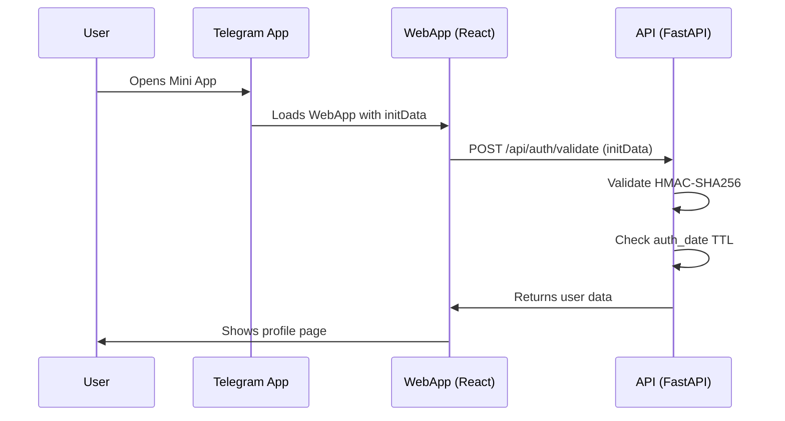

# Mini Apps Authentication

## Overview
Telegram Mini Apps authenticate users using a signed `initData` string. The frontend forwards `initData` to the backend, which validates it using your bot token.

## Quick Links
- [Mini Apps Overview](README.md)
- [API Reference](api-reference.md)
- [Security](security.md)

## How It Works



## What Is initData?
`initData` is a URL-encoded string containing signed user data.

Fields include:
- `query_id`: unique query identifier
- `user`: JSON with user info
- `auth_date`: Unix timestamp
- `hash`: HMAC-SHA256 signature

Example:

```
query_id=AAHdF6IQAAAAAN0XohDhrOrc
&user=%7B%22id%22%3A279058397%2C%22first_name%22%3A%22John%22%7D
&auth_date=1662771648
&hash=89d6079ad6762351f38c6dbbc41bb53048019256a9443988af7a48bcad16ba31
```

## Backend Validation
The backend uses `validate_init_data()` in `source/api/utils/telegram_auth.py`.

Key steps:
1. Ensure `hash` and `auth_date` exist
2. Reject old or future `auth_date`
3. Build `data_check_string`
4. Validate HMAC-SHA256 signature
5. Return parsed user JSON

Simplified version:

```python
import hashlib
import hmac
import json
from datetime import datetime, timezone
from urllib.parse import parse_qs


def validate_init_data(init_data: str, bot_token: str) -> dict | None:
    parsed = parse_qs(init_data)

    received_hash = parsed.get("hash", [None])[0]
    auth_date_str = parsed.get("auth_date", [None])[0]
    if not received_hash or not auth_date_str:
        return None

    auth_date = int(auth_date_str)
    current_ts = int(datetime.now(timezone.utc).timestamp())
    if current_ts - auth_date > 3600:
        return None
    if auth_date > current_ts + 60:
        return None

    data_check_string = "\n".join(
        f"{k}={v[0]}" for k, v in sorted(parsed.items()) if k != "hash"
    )

    secret_key = hmac.new(
        key=b"WebAppData",
        msg=bot_token.encode(),
        digestmod=hashlib.sha256,
    ).digest()

    calculated_hash = hmac.new(
        key=secret_key,
        msg=data_check_string.encode(),
        digestmod=hashlib.sha256,
    ).hexdigest()

    if not hmac.compare_digest(calculated_hash, received_hash):
        return None

    return json.loads(parsed.get("user", [None])[0])
```

## Frontend Usage

### Get initData

```ts
const initData = window.Telegram?.WebApp?.initData || "";
```

### Validate with API

```ts
import { authApi } from "../api";

const response = await authApi.validate();
console.log(response.data);
```

## API Endpoint

### POST /api/auth/validate

Request:

```http
POST /api/auth/validate HTTP/1.1
Authorization: Bearer <initData>
```

Response:

```json
{
  "success": true,
  "data": {
    "id": 1,
    "telegram_id": 123456789,
    "username": "johndoe",
    "first_name": "John",
    "last_name": "Doe",
    "language_code": "en",
    "bio": null,
    "created_at": "2025-01-10T12:00:00Z",
    "updated_at": "2025-01-10T12:00:00Z"
  }
}
```

Errors:

```json
{
  "success": false,
  "error": "Invalid authorization data"
}
```

## Testing Authentication

For local development, you must open the WebApp inside Telegram to receive real `initData`. If you need to mock `initData`, do it only in development and never in production.

## Common Issues

### Invalid authorization data
**Symptoms:** API responds with `Invalid authorization data`.
**Cause:** Token mismatch or invalid signature.
**Solution:** Verify `TG__BOT_TOKEN` and restart the backend.

### auth_date too old
**Symptoms:** API returns 401 after the page is open for a long time.
**Cause:** `auth_date` TTL expired.
**Solution:** Close and reopen the Mini App.

## Best Practices

1. DO validate `initData` for every API request.
2. DO check `auth_date` to prevent replay.
3. DO use `hmac.compare_digest` for signature comparison.
4. DO keep the bot token on the backend only.
5. DO log failed validation attempts.

## Next Steps
- Explore the [API Reference](api-reference.md)
- Learn [Frontend Structure](frontend-guide.md)
- Review [Security](security.md)
