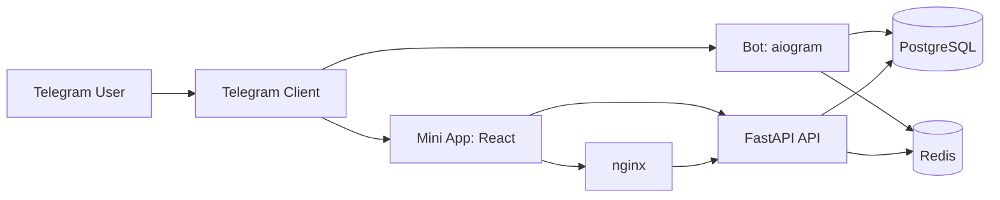
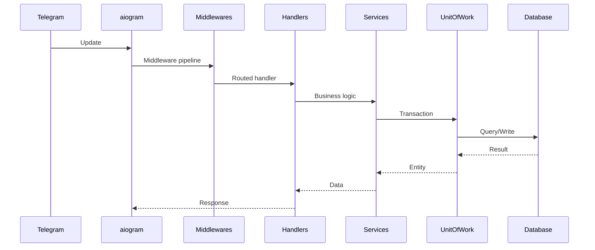
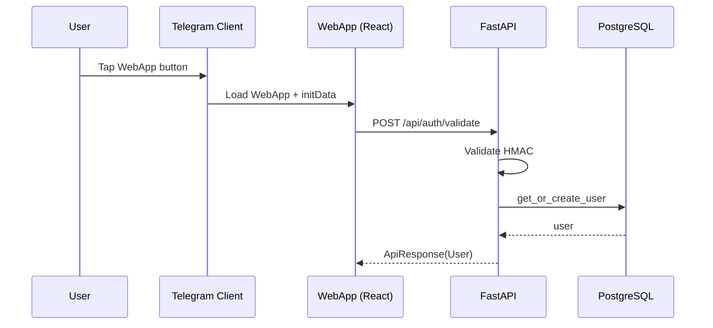

# Architecture Reference

## Overview
This document describes the logical architecture, data flow, and key components of the template.

## High-Level Diagram

## Bot Update Flow

## Mini App Flow

## Component Responsibilities

- **Bot (aiogram)**: Processes updates, commands, callbacks, FSM, dialogs.
- **FastAPI API**: Validates `initData`, exposes Mini App REST endpoints.
- **WebApp (React)**: UI, theme integration, API calls.
- **PostgreSQL**: Persistent user data.
- **Redis**: FSM state and caching.
- **nginx**: Reverse proxy and static file server.

## Common Issues

### Updates not reaching handlers
**Symptoms:** No responses to commands.
**Cause:** Router not included or webhook misconfigured.
**Solution:** Check router registration and webhook settings.

### Mini App cannot access API
**Symptoms:** Authorization error or 401.
**Cause:** API not reachable or invalid `initData`.
**Solution:** Verify proxy routes and bot token.

## Best Practices

1. DO keep handlers thin and delegate to services.
2. DO use the Unit of Work for DB writes.
3. DO validate `initData` for every API request.

## Next Steps
- See [Project Structure](project-structure.md)
- Explore [REST API Reference](rest-api.md)
